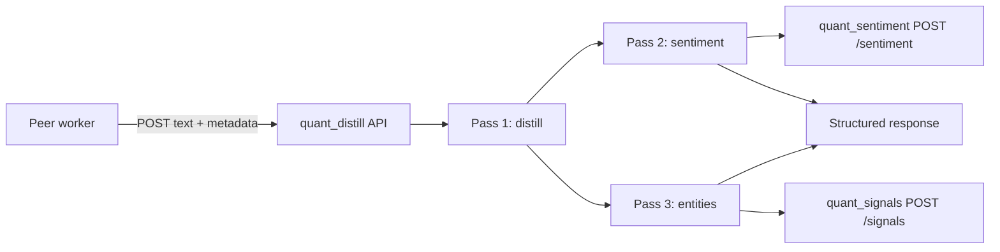

# quant_distill Specification

## 1. Summary

`quant_distill` is the shared backend service that centralizes the LLM-heavy logic currently duplicated across `quant_youtube`, `quant_cnbc`, and `quant_reddit`.

It performs three structured passes:

1. Distillation of source text into a detailed structured summary.
2. Sentiment extraction from that distillation.
3. Entity extraction from that distillation, including company-to-ticker resolution.

It is a stateless processing API. It does not own the source-of-truth datastore for transcripts, Reddit items, CNBC items, entities, or sentiments.

## 2. Goals

1. Replace per-repo distillation, sentiment, and entity orchestration with one shared API.
2. Preserve the current three-pass behavior already present in `quant_youtube`, `quant_cnbc`, and the Reddit parity flow.
3. Return validated structured JSON to peer services rather than storing results locally.
4. Deliver extracted sentiment to `quant_sentiment` and resolved entities to `quant_signals`.
5. Follow the backend coding standards: Bottle app factory, Pydantic settings, JSON errors, Docker, CI, typing, and tests.

## 3. Non-goals

1. No owned Postgres schema in v1.
2. No Alembic migrations in v1.
3. No direct persistence of source text, summaries, sentiments, or entities.
5. No YouTube, CNBC, Reddit, or other source acquisition logic.

## 4. Core Behavior

The common contract is derived from the current service repos.

### Pass 1: Distillation

Returns:

- `summary: str`
- `key_topics: list[str]`
- `segments: list[{speaker, role, summary}]`

Long inputs use map/reduce chunking with a fallback when the reduce result is too thin.

### Pass 2: Sentiment

Returns:

- `observations: list[{subject_type, subject, sentiment_label, sentiment_score, confidence, horizon, reason}]`

Normalization rules:

- clamp `sentiment_score` to `[-1, 1]`
- clamp `confidence` to `[0, 1]`
- uppercase ticker subjects

### Pass 3: Entities

Returns:

- `entities: list[{raw_mention, entity_type, company_name, ticker, speaker, direction, confidence, context}]`

Normalization rules:

- uppercase tickers
- coerce unknown entity types to `company`
- drop invalid directions instead of failing the whole batch
- de-duplicate by `ticker` or raw mention within a request

## 5. Architecture



Peer services remain responsible for discovery, source storage, local persistence, and any final downstream fanout they still own.

## 6. HTTP API

### Operational endpoints

| Method | Path | Purpose |
|---|---|---|
| GET | `/health` | Liveness only |
| GET | `/ready` | LLM reachable; optional dependencies checked when configured |
| GET | `/stats` | In-memory counters and latency summaries |
| GET | `/capabilities` | Model, prompt versions, limits, enabled enrichments |

### Processing endpoints

| Method | Path | Purpose |
|---|---|---|
| POST | `/v1/process` | Full pipeline: text -> distillation + sentiment + entities + optional enrichments |
| POST | `/v1/distill` | Distillation only |
| POST | `/v1/sentiment` | Sentiment from an existing summary |
| POST | `/v1/entities` | Entity extraction from an existing summary |

## 7. Request and Response Contracts

### POST `/v1/process`

Request:

```json
{
  "source": "quant_youtube",
  "source_type": "youtube",
  "source_item_id": "abcdefghijk",
  "title": "Episode title",
  "text": "full source text here",
  "observed_at": "2026-08-11T12:00:00Z",
  "metadata": {
    "channel": "allin",
    "url": "https://youtube.com/watch?v=abcdefghijk"
  },
  "options": {
    "include_sentiment": true,
    "include_entities": true,
    "include_watchlist": true,
    "watchlist_required": false,
    "max_chunk_chars": 12000
  }
}
```

Response:

```json
{
  "status": "ok",
  "request_id": "9bc2e6d2-3c18-4f43-a1ae-3d0efbcb8bde",
  "service": "quant-distill-api",
  "source": {
    "source": "quant_youtube",
    "source_type": "youtube",
    "source_item_id": "abcdefghijk",
    "observed_at": "2026-08-11T12:00:00Z"
  },
  "processing": {
    "model": "llama3.1",
    "distill_prompt_version": "v1",
    "sentiment_prompt_version": "v1",
    "entity_prompt_version": "v1",
    "chunk_count": 2,
    "durations_ms": {
      "distill": 810,
      "sentiment": 115,
      "entities": 121,
      "total": 1087
    },
    "token_usage": {
      "prompt_tokens": 2100,
      "completion_tokens": 750,
      "total_tokens": 2850
    },
    "warnings": []
  },
  "distillation": {
    "summary": "**Topic 1**: ...",
    "key_topics": ["AI", "Semis"],
    "segments": [
      {"speaker": "Host", "role": "host", "summary": "..."}
    ]
  },
  "sentiment": {
    "observations": [
      {
        "subject_type": "ticker",
        "subject": "AAPL",
        "sentiment_label": "bullish",
        "sentiment_score": 0.8,
        "confidence": 0.7,
        "horizon": "5d",
        "reason": "positive guidance"
      }
    ]
  },
  "entities": {
    "items": [
      {
        "raw_mention": "Apple",
        "entity_type": "company",
        "company_name": "Apple Inc.",
        "ticker": "AAPL",
        "speaker": "Host",
        "direction": "long",
        "confidence": 0.8,
        "context": "positive iPhone commentary",
        "watchlist": {
          "entries": [{"signal_id": "signal:..."}]
        }
      }
    ]
  }
}
```

### POST `/v1/distill`

Request:

```json
{
  "text": "raw source text",
  "source": "quant_cnbc",
  "source_item_id": "CNBC_20260702_220000_Mad_Money",
  "options": {
    "max_chunk_chars": 12000
  }
}
```

### POST `/v1/sentiment`

Request:

```json
{
  "summary": "distilled summary text",
  "source": "quant_reddit",
  "source_item_id": "t3_abc123"
}
```

### POST `/v1/entities`

Request:

```json
{
  "summary": "distilled summary text",
  "source": "quant_youtube",
  "source_item_id": "abcdefghijk",
  "options": {
    "include_watchlist": true
  }
}
```

## 8. Delivery Contracts

### Sentiment API

For every extracted sentiment observation, POST to `quant_sentiment`:

1. `POST /sentiment`
2. Include a stable idempotency key based on source, source item, subject, model, and prompt version.

### Signals Watchlist API

For every resolved entity, POST to `quant_signals`:

1. `POST /signals`
2. Include the resolved ticker, extraction context, and a stable idempotency key based on source, source item, ticker, model, and prompt version.

### Failure semantics

1. If a delivery API is unavailable and not required, return the primary extraction result plus a warning.
2. If a required delivery API is unavailable, return `503` with the standard error envelope.

## 9. Error Envelope

All endpoints use this JSON error shape:

```json
{
  "status": "error",
  "code": "validation_error",
  "error": "Invalid request",
  "detail": "field 'text' must not be empty"
}
```

HTTP semantics:

- `400` malformed JSON
- `404` route not found
- `422` validation failure
- `429` local rate-limit or concurrency cap
- `500` internal failure
- `503` LLM or required dependency unavailable

## 10. Migration Guidance

### quant_youtube

1. Keep discovery and transcript fetch local.
2. Replace local distill and extraction orchestration with `POST /v1/process`.
3. Persist the returned distillation, entity, and sentiment artifacts locally.

### quant_cnbc

1. Keep archive discovery and transcript fetch local.
2. Replace the current in-process pass chain with one remote `POST /v1/process` call.
3. Preserve CNBC-owned storage and read APIs.

### quant_reddit

1. Keep Reddit ingestion local.
2. Replace the in-process three-pass compatibility flow with `POST /v1/process`.
3. Convert the returned entity and sentiment payloads into any Reddit-specific ledger format still required.

## 11. Delivery Slices

### Slice 0

- scaffold
- config
- app factory
- health and ready

### Slice 1

- distillation core
- map/reduce
- thin-reduce fallback

### Slice 2

- sentiment and entities
- validation and normalization

### Slice 3

- full process endpoint
- aggregated timings and token usage

### Slice 4

- quant_sentiment and quant_signals delivery
- optional dependency behavior

### Slice 5

- stats
- capabilities
- Docker
- supervisord
- CI
